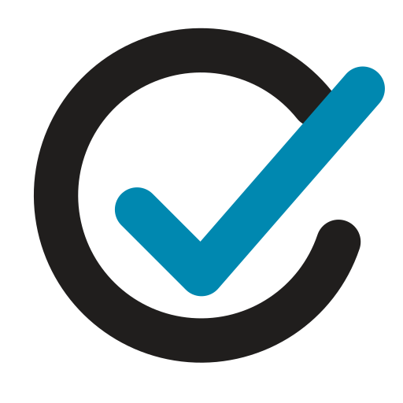
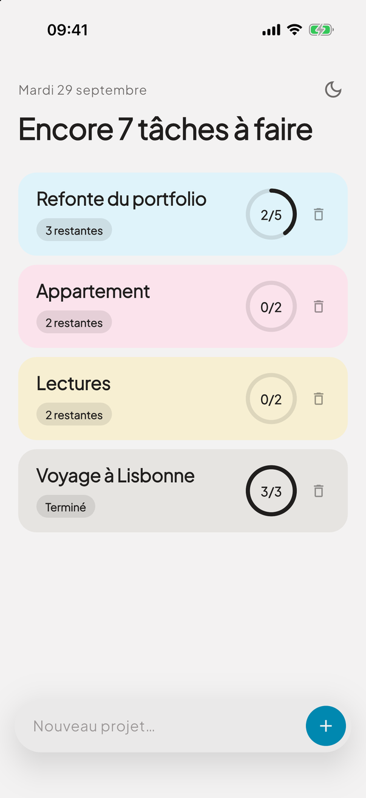
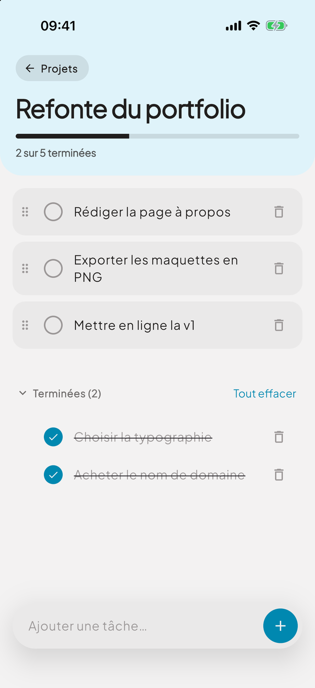
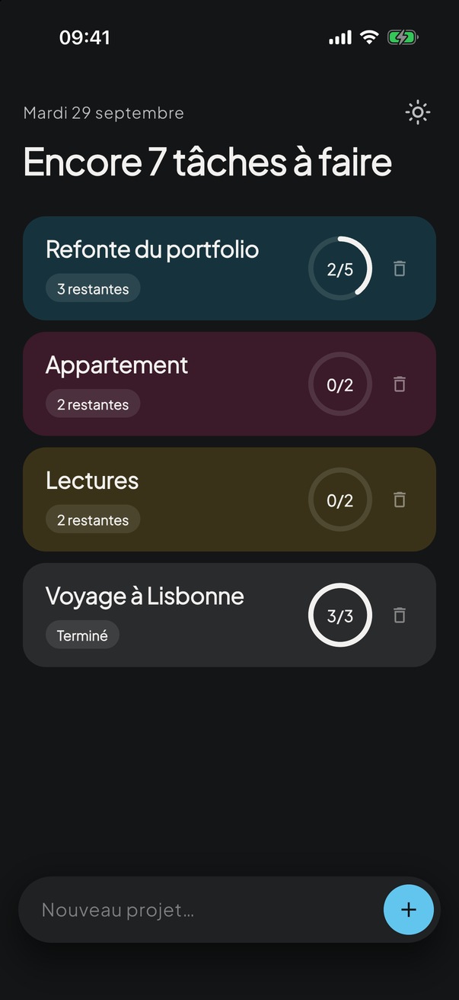
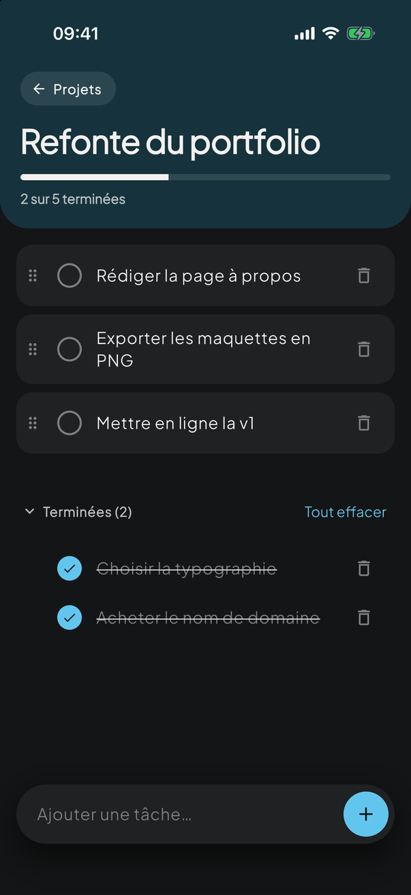

**Français** · [English](README.md)

<p align="center">
  <picture>
    <source media="(prefers-color-scheme: dark)" srcset="assets/logo/logo-dark.svg">
    
  </picture>
</p>

<h1 align="center">Done</h1>

<p align="center">
  <a href="https://github.com/raphaelApard/Done/actions/workflows/ci.yml"></a>
</p>

<p align="center">Une app de tâches calme et pastel, organisée par projets. Écrite en Flutter, elle fonctionne hors ligne et suit le thème clair ou sombre du système.</p>

<p align="center">
  
  
  
  
</p>

## Fonctionnalités

- **Projets** avec une carte teintée, un anneau de progression et une ligne de statut (« 3 restantes »).
- **Tâches** : ajout à la chaîne, édition en place (toucher le texte), réordonnancement par glisser sur la poignée, cocher, supprimer.
- **Section « Terminées »** repliable, avec « Tout effacer » en un geste.
- **Suppression sécurisée** : projets et tâches sont supprimés après confirmation, et les projets peuvent aussi être balayés.
- **Thèmes clair et sombre** : suit le système par défaut, avec un bouton de bascule sur l'accueil.
- **Persistance locale** : tout est enregistré sur l'appareil, sans compte ni réseau.
- **Splash animé** : le cercle du logo se dessine, puis la coche en sort (ignoré quand le système réduit les animations).

L'interface est en français.

## Démarrage

Prérequis : [Flutter](https://docs.flutter.dev/get-started/install) 3.47 ou plus (Dart 3.13).

```bash
git clone git@github.com:raphaelApard/Done.git
cd Done
flutter pub get
flutter run
```

Choisir un appareil avec `flutter run -d <appareil>` (`flutter devices` les liste). Plus Jakarta Sans est téléchargée par `google_fonts` au premier lancement, qui demande donc une connexion réseau.

Le projet cible iOS, Android, macOS et le web. Il a été lancé et vérifié sur le simulateur iOS ; les autres cibles sont générées par `flutter create` et n'ont pas été testées à la main.

## Tests

```bash
flutter analyze
flutter test
```

La suite couvre les modèles, le store (persistance et données corrompues comprises), les thèmes, les widgets et les parcours principaux à travers les écrans. La CI lance ces deux commandes à chaque push et chaque pull request.

## Application web (PWA)

`pwa/` contient une seconde version autonome de Done : une application web installable qui reproduit exactement le design « Todo App v2 ». Elle est écrite en HTML, CSS et JavaScript, sans étape de build ni dépendance, fonctionne hors ligne et garde ses données dans le navigateur.

```bash
cd pwa
npm start   # sert http://localhost:8080
npm test
```

Voir [docs/pwa.fr.md](docs/pwa.fr.md) pour ses fonctionnalités, sa structure et son déploiement.

## Structure du projet

```
lib/
├── main.dart               point d'entrée et DoneApp (thème, langue, largeur max)
├── models.dart             Project et Task, sérialisation JSON
├── store.dart              TodoStore : état et persistance (shared_preferences)
├── seed.dart               projets d'exemple au premier lancement
├── todo_scope.dart         donne accès au store aux widgets
├── theme.dart              thèmes clair et sombre, teintes des projets
├── screens/
│   ├── home_screen.dart    liste des projets
│   ├── project_screen.dart liste des tâches
│   └── splash_gate.dart    logo animé au démarrage
└── widgets/
    ├── check_circle.dart
    ├── composer.dart       pilule flottante d'ajout
    ├── confirm_dialog.dart
    ├── logo_mark.dart      le logo, dessiné avec un painter
    └── progress_ring.dart
assets/logo/                sources SVG du logo et de l'icône d'app
tool/generate_icons.py      génère toutes les icônes d'app raster
```

L'état tient dans un seul `ChangeNotifier`, exposé par un `InheritedNotifier` : aucune dépendance de gestion d'état.

## Design

L'interface est un portage de la proposition « Pastel » faite avec Claude Design : Plus Jakarta Sans, cartes pastel par projet, composeur en pilule et variante sombre. Le logo, une coche qui sort de son cercle, vient du même projet. La PWA suit une proposition plus récente du même projet, « Todo App v2 » (voir [docs/pwa.fr.md](docs/pwa.fr.md)).

### Logo et icônes d'app

`assets/logo/` contient les sources SVG. Les icônes iOS (par défaut, sombre et teintée), Android (calques adaptatif et monochrome, plus PNG hérités), web, PWA et macOS sont générées à partir de la même géométrie :

```bash
pip install pillow
python3 tool/generate_icons.py
```

Le script n'écrit que des PNG. Les calques vectoriels Android, les `Contents.json` et les écrans de lancement sont des fichiers ordinaires dans les dossiers des plateformes. Au lancement, l'écran natif affiche le fond de l'app et `SplashGate` y dessine le logo.

## Contribuer

Le travail se fait sur des branches courtes issues de `develop` (`feat/…`, `fix/…`, `docs/…`) et fusionnées par pull request. `main` ne reçoit que des merges taggés depuis `develop`. Le job `check` de la CI (`flutter analyze` et `flutter test`) doit passer avant de pouvoir merger une pull request dans `develop` ou `main` : la protection de branche l'impose, administrateurs compris. Une release est une pull request de `develop` vers `main`, taggée une fois mergée. Les commits suivent [Conventional Commits](https://www.conventionalcommits.org/).
